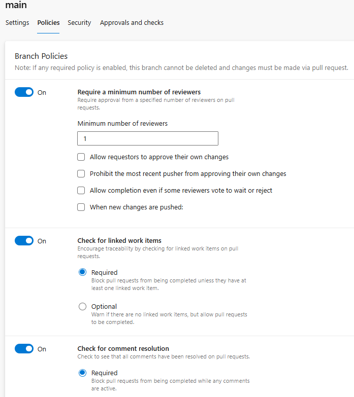

# TP3: Azure DevOps

## Conceptos a abordar

### Diferencias entre Epic, User Story y Task

- **Epic:** Representa un objetivo grande o un módulo completo del sistema. Se utiliza para agrupar varias funcionalidades relacionadas.  
  Ejemplo: *"Módulo de Gestión de Usuarios"*.

- **User Story:** Describe una necesidad concreta desde la perspectiva del usuario, de manera simple y entendible.  
  Ejemplo: *"Como usuario quiero registrarme para poder iniciar sesión en la aplicación"*.

- **Task:** Es la unidad de trabajo más pequeña. Detalla la actividad técnica que hay que hacer para completar una User Story.  
  Ejemplo: *"Crear el endpoint `/register` en el backend"* o *"Diseñar el formulario de registro en el frontend"*.

### Ventajas de Azure Pipelines

- **Integración nativa** con Azure Repos y Boards: los builds pueden vincularse automáticamente a work items y PRs.
- **Multiplataforma:** soporta .NET, Java, Node.js, Docker y contenedores sin necesidad de herramientas externas.
- **Escalabilidad:** permite ejecutar pipelines en agentes en la nube de Microsoft sin costo inicial.
- **Plantillas y YAML:** facilita automatizar builds y despliegues con archivos versionados en el repo.
- **Integración con QA/PROD:** un mismo pipeline puede desplegar en entornos diferentes con aprobaciones manuales.

Comparado con otras herramientas como Jenkins o GitHub Actions, Azure Pipelines reduce el trabajo de configuración inicial y centraliza todo en un único lugar (repos, boards, pipelines).

### Pull Requests (PR)

Un **Pull Request** es una solicitud de integración de cambios de una rama de feature a la rama principal (`main`).

**Cómo lo usé en el TP:**

- Creé ramas `feature/registro` y `feature/login` para desarrollar funcionalidades de forma aislada.
- Realicé commits atómicos en cada rama desde el portal de Azure DevOps.
- Abrí PRs desde la UI, vinculando los work items correspondientes.
- Me agregué como reviewer y aprobé los PRs.
- Completé los PRs usando **merge commit** para mantener el historial de cambios.

**Beneficios:**

- Permite revisión de código antes de integrarlo a `main`.
- Mantiene el repositorio limpio y trazable.
- Facilita discutir cambios mediante comentarios y sugerencias en el portal.

## 1. Configuración inicial
### Metodología elegida: Agile
Elegí Agile porque es el proceso recomendado para equipos que trabajan con Scrum/Kanban y necesitan iteraciones cortas y métricas de avance. Ofrece Epics → Features → User Stories → Tasks, lo que permite una buena jerarquía de trabajo y visibilidad.
### Organización: baujuncos (ya la había creado antes).
### Proyecto:
- Nombre: TP3_IS3
- Visibilidad: privado.
- Version Control: repositorios Git.
- Metodología de trabajo: Agile.

### Equipos y áreas:
Configuré el equipo principal por defecto y lo mantuve como único equipo, ya que el proyecto es pequeño. En Project Settings > Teams, me aseguro de que haya al menos un equipo principal (TP3_IS3 Team) y en Project Settings > Project configuration, configuro las áreas que me parecen imprescindibles (backend, frontend y QA).

>

>

## 2. Gestión del trabajo con Azure Boards

### Estructura de work items:
- 1 Epic: "Módulo de Gestión de Usuarios" asociado a área Backend del proyecto.

- 3 User Stories: Registro, Login, Edición de Perfil (las creamos utilizando Related Work dentro del Epic para asociarlas más rápido, con un tipo de link Child).

>**US01**

>**US02**

>**US03**

>**Así queda el Epic con sus User Stories:**
>
> 

NOTA: En los screens me olvidé de asignar responsable (en este caso yo) y clasificación (Business o Architectural) a los WorkItems, pero SÍ lo hice.

- 2 Tasks por cada User Story: lo hago análogamente al paso anterior, es decir, me meto en cada US y creo un Item en Related Work con tipo de Link Child (siguiendo la jerarquía: Epic -> User Story -> Task -> Bug).

>**US01**: Registro de usuarios.
>
> Task1:
>
>
> Task2:
>

>**US02**: Login de usuarios.
>
> Task1:
> 
> Task2:
> 

>**US03**: Edición de perfil.
>
> Task1:
> 
> Task2:
> 

- 2 Bugs de ejemplo.

> Bug en Task1 de US2 (Endpoint autenticación)
> 

> Bug en
> 

### Work Items hasta ahora:

### Sprint:
- Primero que nada, en Project Configuration establezco los nombres correspondientes (Sprint 1, 2 y 3) y las duraciones (2 semanas todos) para poder asignar con el sprint bien configurado.
  
  

- Ahora asigno todos los Work Items al Sprint 1: estas 2 semanas nos permite planificar entregables cortos y medibles.

  <ins>Problema encontrado</ins>: no aparecen mis WorkItems en Boards ni en Backlogs.

  <ins>Solución</ins>: esto pasaba porque están configurados en área Backend y no eran visibles para mí. Por lo tanto, edito las configuraciones de equipos. **Project Settings -> Team configuration -> Areas -> Selecciono todas las áreas que posee mi equipo (Backend)**

  Procedo a ir a Backlog y a asignar las UserStories y el Epic al Sprint 1

### Organizo mi Kanban

### Justificación:
Esta estructura jerárquica facilita la trazabilidad: cada Task se asocia a una User Story y esta a su Epic (y los Bugs a las Tasks). Esto permite ver claramente el progreso en el tablero Kanban.

## 3. Control de versiones con Azure Repos

### Repositorio:
Importé el proyecto de ejemplo desde GitHub (SimpleWebAPI).

### Políticas de calidad:
En **Repos > Branches > main > Branch policies** activó lo siguiente:

✔ Require a minimum number of reviewers = 1

✔ Check for linked work items

✔ Check for comment resolution

### Flujo de trabajo:
- Creé ramas feature/registro y feature/login: también les asocié work items según corresponda a cada caso.
  

- Hice commits atómicos en cada rama:
  

- Generé Pull Requests y los aprobé para merge a main.

>PULL REQUEST 1:
>
> 
>
> - Para aprobarlo debo ir y modificar la política de la branch Main para que permita que el mismo autor del Pull Request apruebe el cambio o merge. Si no, espera a un reviewer aparte del autor para dar su aprobación.
>
> 
>
> - Procedo a completar el Pull Request:
>
> 

>PULL REQUEST 2 (hago exactamente lo mismo):
>
> - Apruebo Pull Request:
>
> 
>
> - Completo Pull Request:
>
> 

### Justificación:
Con este flujo aseguramos que ningún cambio llegue a `main` sin revisión y trazabilidad. Las políticas evitan pushes directos y mantienen el repositorio estable.
