# TP4: Azure DevOps Pipelines

## Aplicación a usar
Usaremos la misma aplicación que en el TP2 de Docker ya que conocemos la estructura y el funcionamiento del mismo. 
* El Stack elegido: React (Frontend) + Go (Backend) porque:
  * React es una librería madura, fácil de usar para construir SPA (Single Page Applications) y se integra muy bien con APIs REST. 
  * Go es un lenguaje eficiente y muy usado para desarrollar APIs y microservicios, con compilación rápida y binarios livianos (excelente para CI/CD).

Ambos tienen soporte nativo en Azure DevOps (tareas para Node/npm y Go) lo que simplifica la construcción del pipeline.

* Estructura del repositorio:

>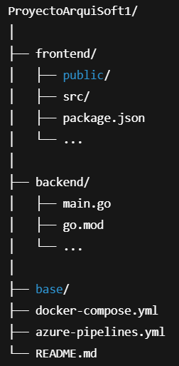

### 1. Importación de repositorio a utilizar con éxito.
* Importo repositorio Github en Azure DevOps, en mi proyecto TP4_IS3 de organización "baujuncos"

>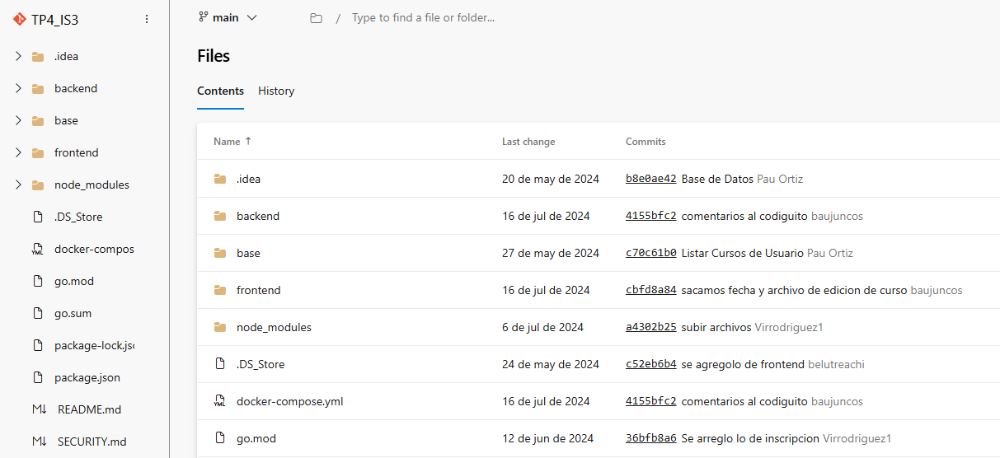

## Agent Pool y Self-Hosted Agent
En Azure DevOps, un Agent Pool (o "Grupo de Agentes" en español) es una colección de agentes de compilación o
liberación que están disponibles para ejecutar mis trabajos de pipeline.

### ¿Qué es un Agente?

Primero, un agente es un software que se ejecuta en una máquina (virtual o física) y que escucha los trabajos de un pipeline
de Azure DevOps. Cuando un pipeline necesita ejecutar una tarea (como compilar código, ejecutar pruebas o desplegar una
aplicación), Azure DevOps asigna esa tarea a un agente disponible en el pool.

### Tipos de Agentes y su Relación con los Pools
Hay dos tipos principales de agentes, y cada uno se organiza en pools:

1. **Microsoft-Hosted Agents (Agentes Hospedados por Microsoft):**

* ¿Qué son? Son agentes preconfigurados y gestionados por Microsoft. No necesitas configurar ni mantener la infraestructura subyacente.

* ¿Cómo funcionan? Cuando usas un pipeline y seleccionas un pool de agentes hospedados por Microsoft (como ubuntu-latest, windows-latest, macOS-latest), Azure DevOps automáticamente aprovisiona una máquina virtual nueva y limpia para tu trabajo, la ejecuta y luego la descarta.

* Ventajas: Facilidad de uso, no hay mantenimiento, siempre máquinas limpias, escalabilidad ilimitada.

* Desventajas: Puede no tener todas las herramientas específicas que necesitas, tiempos de arranque variables,
recursos compartidos.

2. **Self-Hosted Agents (Agentes Auto-Hospedados):**
* ¿Qué son? Son agentes que instalas y gestionas vos mismo en tus propias máquinas (servidores locales, VMs en
la nube, contenedores, etc.).

* ¿Cómo funcionan? Vos instalas el software del agente de Azure DevOps en una máquina de tu elección. Luego,
registras este agente en un Agent Pool personalizado que creas en Azure DevOps. Cuando un pipeline especifica
usar ese pool personalizado, Azure DevOps le asigna el trabajo a uno de tus agentes disponibles en ese pool.

* Ventajas: Control total sobre el entorno y las herramientas instaladas (SDKs, software propietario), acceso a
recursos de red privados, reutilización de la misma máquina (más rápido para dependencias), potencialmente
más barato para uso intensivo.

* Desventajas: Necesitas mantener la infraestructura (seguridad, actualizaciones), escalar es mi responsabilidad,
requiere configuración manual.

### ¿Por qué son importantes los Agent Pools?
* Organización: Permiten agrupar agentes con capacidades similares. Por ejemplo, podrías tener un pool llamado MyDotnetAgents para agentes con el SDK de .NET, y otro MyNodeAgents para agentes con Node.js.

* Control de Acceso: Puedes definir quién tiene permiso para usar ciertos pools de agentes.

* Escalabilidad: Si tienes varios agentes en un pool, Azure DevOps puede distribuir los trabajos entre ellos, permitiendo que múltiples pipelines se ejecuten simultáneamente.

* Flexibilidad: Te permiten elegir el tipo de infraestructura que mejor se adapte a tus necesidades. Si necesitas hardware específico o acceso a una red interna, usarás un pool con agentes self-hosted.

### 1. Agent Pool

* Organization Settings -> Pipelines -> Agent Pools -> Add Pool
  * Pongo un nombre descriptivo: IS3-Pool
  * Dejo la visibilidad para todos los proyectos

>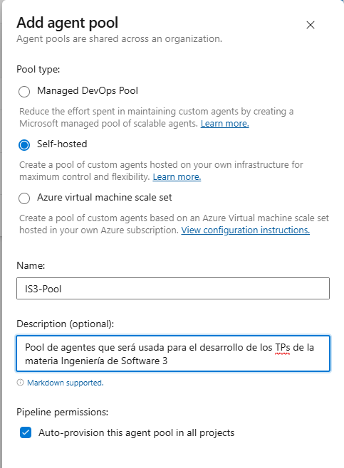

### 2. Self-Hosted Agent
* Dentro del pool recién creado, hago clic en New Agent:
  * Elijo el sistema operativo de mi máquina (Windows).
  * Bajo el ZIP con el agente:

> 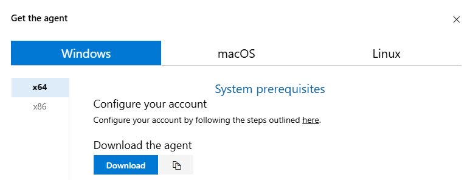

* Abro PowerShell y sigo las instrucciones que me proporciona Azure:

>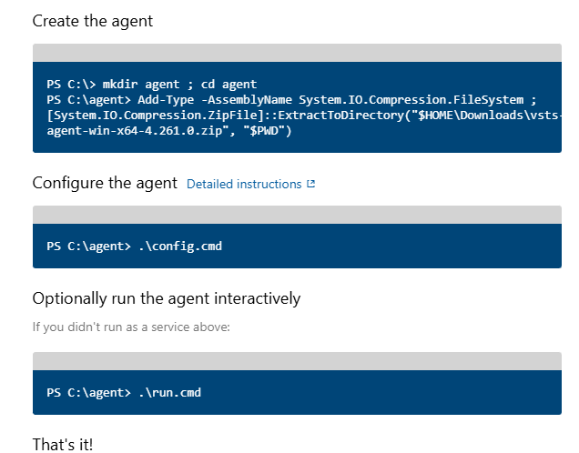
> 
> 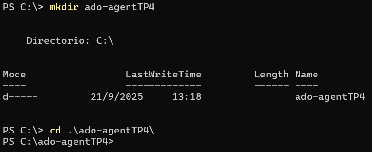
> 
> 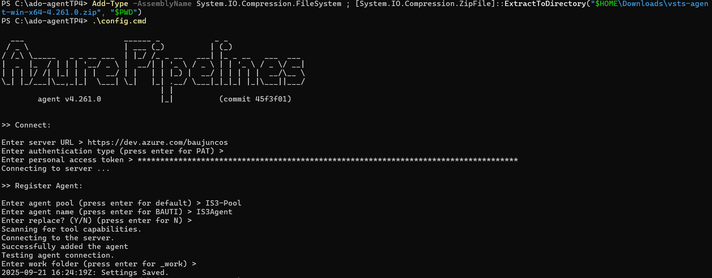
> 

* Lo corremos para probar que funcione:

> 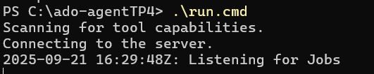
> 
> 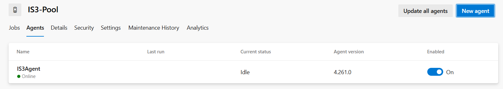

## Creamos y desarrollamos nuestro azure-pipelines.yml

### Está preparado para correr en mi Self-Hosted Agent y hacer:
* CI en main 
* Build front (npm ci && npm run build)
* Build back (Go: go mod download && go build && go test)
* Publicación de artefactos de ambos (dist/bin)

### ¿Qué hace cada parte?
* trigger: main → Ejecuta CI automáticamente con cada push a main. 
* pool: SelfHosted → Todo corre en mi agente local. 

### Stage: CI (Front + Back)

### Job: Build Frontend
1. **NodeTool@0 – Use Node 18.x**

Fuerza a usar Node 18 en el agente. Evita problemas por versiones.

2. **Npm@1 – npm ci**

Instala dependencias de frontend/ en modo limpio (usa package-lock.json).

3. **Npm@1 – npm run build**

Compila el front (CRA) y genera la salida frontend/build optimizada.

4. **PublishBuildArtifacts – front_drop**
   
Publica el contenido de frontend/build como artefacto llamado front_drop.
   → Es el “paquete estático” del front para desplegar donde quiera (nginx/IIS/serve).

### Job: Build Backend (Go)
1. **GoTool@0 – Use Go 1.21**
   
Asegura la versión de Go en el agente.

2. **go mod download**

Descarga dependencias del módulo (toma go.mod/go.sum del repo).

3. **CmdLine@2 – go build (en /backend)**

Compila la API parándose en backend/ y deja el binario en $(Build.ArtifactStagingDirectory)\backend-api.exe.

4. **CmdLine@2 – go test (en /backend)**

Ejecuta tests.

5. **PublishBuildArtifacts – back_drop**

Publica el binario (y lo que pongas en el staging) como artefacto llamado back_drop.

## Creo mi Pipeline

Configuro manualmente un pipeline que será automático basado en nuestro .yml:

> 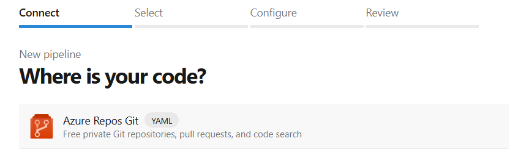
> 
> 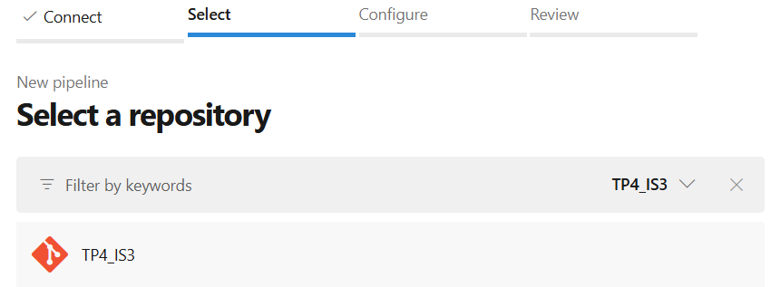
> 
> 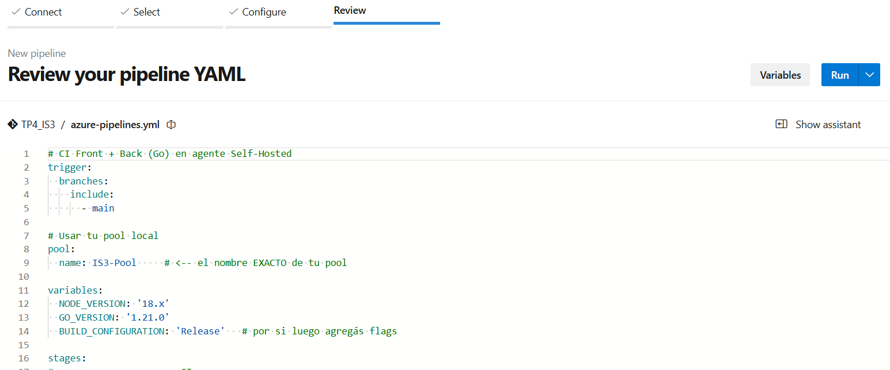
> 

## Corro el Pipeline

* Vista desde el Agent Pool usado para el pipeline: IS3-Pool. Se muestran ambos jobs correspondiendose cada uno con
  backend y frontend respectivamente.

> 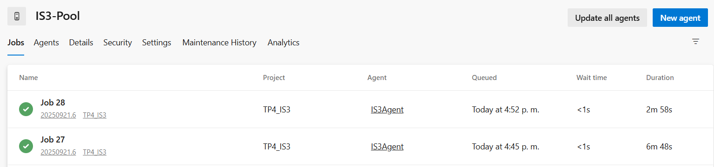
> 
> 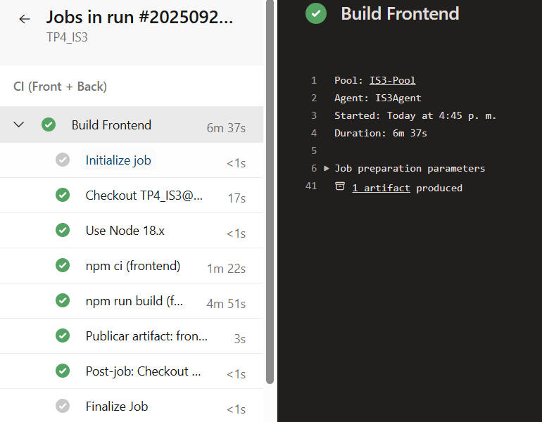
> 
> 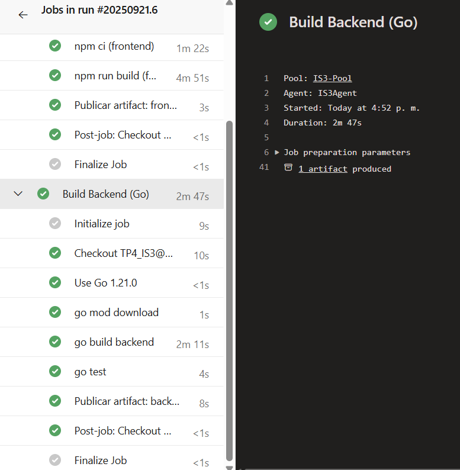
> 

* Vista desde sección Pipelines donde se muestra que se desplegaron con éxito ambos jobs y que ambos publicaron sus
  drops correspondientes ya que indica "2 published":

> 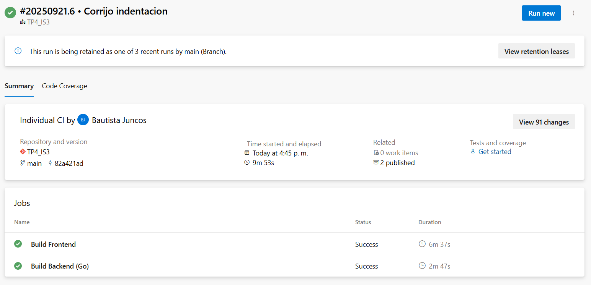
> 

* Artefactos creados como corresponde:

> 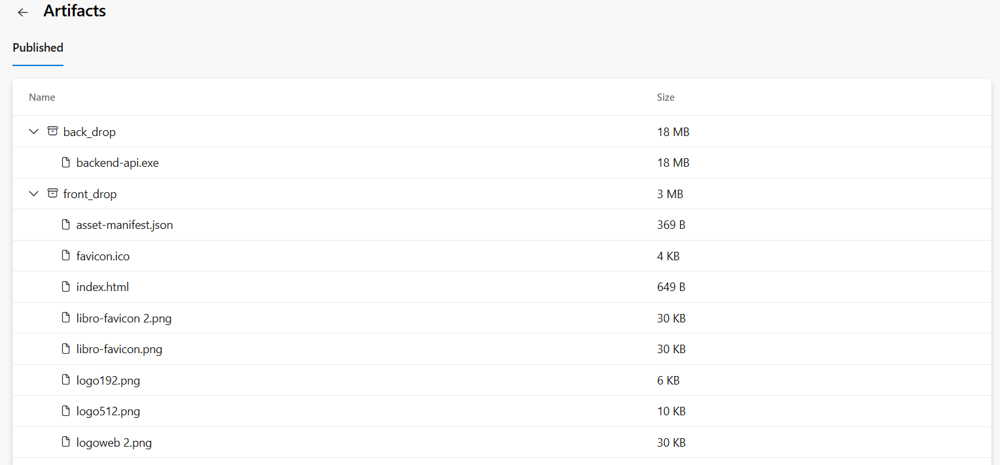

